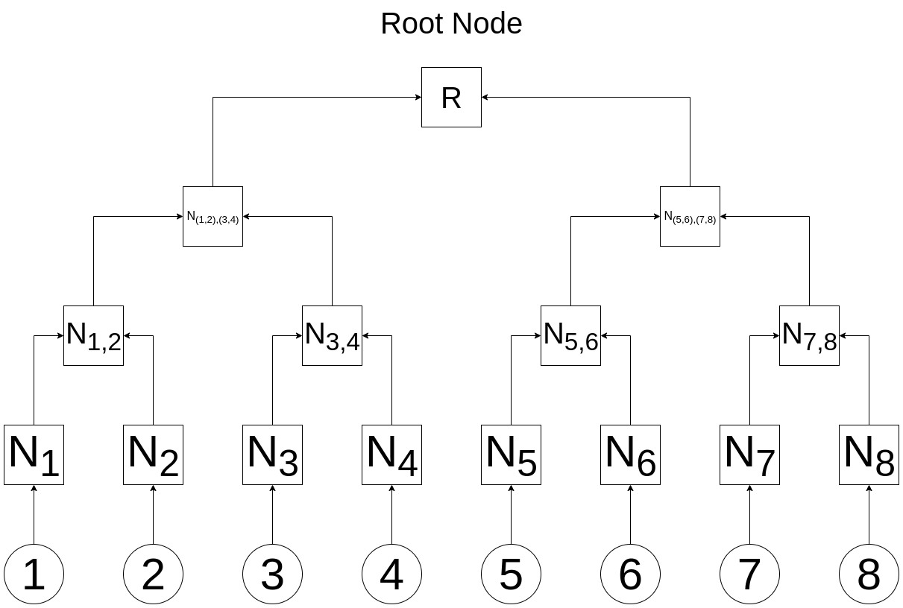
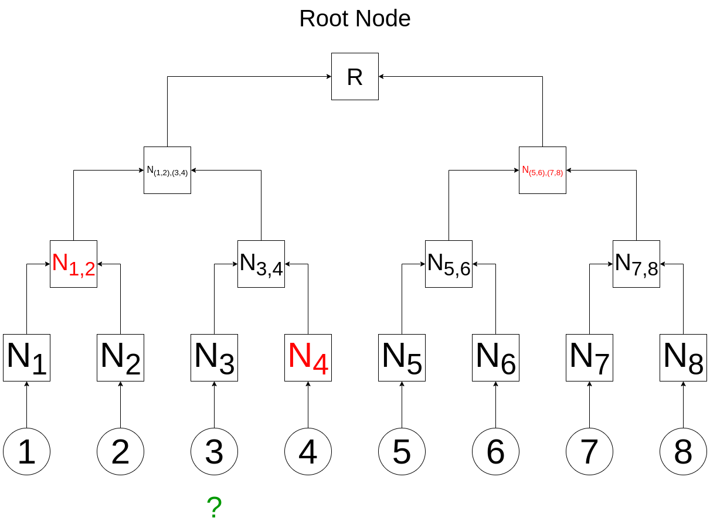

# Merkle_Trees
## What is a Merkle Tree?

In cryptography and computer science, a hash tree or Merkle Tree is a tree in which we label every "leaf" (node) with the cryptographic hash of some data. We can use Merkle Trees to prove that data is included in a list while keeping the storage required to perform that proof to a minimum.

Let's see how!

## How does all of this work? Let's build a Merkle Tree

First, we need to start with a data set we want to track. Because programmers often use Merkle Trees in this manner, let's use a list of Ethereum wallet addresses as our data. In this case, we'll use the following fictitious set of addresses:

```
allowlist = ['0x1111111111111111111111111111111111111111',
              '0x2222222222222222222222222222222222222222',
              '0x3333333333333333333333333333333333333333',
              '0x4444444444444444444444444444444444444444',
              '0x5555555555555555555555555555555555555555',
              '0x6666666666666666666666666666666666666666',
              '0x7777777777777777777777777777777777777777',
              '0x8888888888888888888888888888888888888888']
```

Let's say this is a list of addresses that can perform some action on the Ethereum blockchain - perhaps being allowed to purchase an NFT during a pre-sale period.

In the following diagram, we show each of our addresses. Using the example list of addresses shown above, item #1 is 0x1111111111111111111111111111111111111111; item #2 is 0x2222222222222222222222222222222222222222, and so on.

&nbsp;


&nbsp;

### Level #1

Wonderful! Now, we're going to apply a cryptographically sound hashing function to each piece of data. In this case, N<sub>1</sub> is created by running our cryptographic function (let's call it H) on data item #1, which we'll designate by N<sub>1</sub> = H(1):

&nbsp;


&nbsp;

In this case, using our designated notation, we have:

N<sub>1</sub> = H(1)

N<sub>2</sub> = H(2)

N<sub>3</sub> = H(3)

N<sub>4</sub> = H(4)

N<sub>5</sub> = H(5)

N<sub>6</sub> = H(6)

N<sub>7</sub> = H(7)

N<sub>8</sub> = H(8)

These nodes (that's why we're calling them _N_), which are the direct result of hashing our data, are known as _Leaf Nodes_.

### Level #2

Now, we're going to add the next level up. These nodes (known as _branch_, _inner node_, or _inode_) are created by taking the hash of the two nodes that feed into it, concatenating those values (left to right), and the hashing the resulting value. So we'll designate that function as H(L+R):

&nbsp;


&nbsp;

Now, using our designated notation, we've created:

N<sub>1,2</sub> = H(H(1) + H(2))

N<sub>3,4</sub> = H(H(3) + H(4))

N<sub>5,6</sub> = H(H(5) + H(6))

N<sub>7,8</sub> = H(H(7) + H(8))

### Level #3

Adding another level, we have:

&nbsp;


&nbsp;

We're continuing to use our designated notation, and now, we've created two more _inodes_:

N<sub>(1,2),(3,4)</sub> = H((H(1) + H(2)) + (H(3) + H(4)))

N<sub>(5,6),(7,8)</sub> = H((H(5) + H(6)) + (H(7) + H(8)))

### The Root

We finally arrive at the root of our tree, which we'll call _R_. 

&nbsp;



&nbsp;

Using the same notation, the root value is created:

R = H(H((H(1) + H(2)) + (H(3) + H(4))) + H((H(5) + H(6)) + (H(7) + H(8))))

## But Professor Petabyte, what's the point?

Oh, I'm so delighted you asked!

The point is this:

* Our tree has 15 node values created by our eight original pieces of data
* We can provide someone with three values from the tree, called a _proof_ that, combined with their one piece of original data, someone can mathematically prove that their data was part of the data used to build the tree, so long as we know the _root_ value.
* This _proof_ provides no information to the user about any other data used to create the tree.
* This has many interesting applications, from identifying possible data corruption in the InterPlanetary File System (IPFS), Btrfs, and ZFS file systems, to identifying changes in Git and Mercurial repositories, to keeping track of transactions within blocks of the Bitcoin and Ethereum blockchain networks.

Let's see how it works:

Imagine you're the owner of data item #3 and want to prove that your data is part of the tree. The creator of the tree would provide you with the node data highlighted in red in the following diagram:

&nbsp;



&nbsp;

Your _proof_ would consist of just three integers:

[N<sub>4</sub>, N<sub>1,2</sub>, N<sub>(5,6),(7,8)</sub>]

Using these values and data item #3, anyone can re-calculate the root value: 

* You can calculate N<sub>3</sub> from data item #3.
* With N<sub>3</sub> and N<sub>4</sub>, you can calculate N<sub>3,4</sub>.
* With N<sub>3,4</sub> and N<sub>1,2</sub>, you can calculate N<sub>(1,2),(3,4)</sub>.
* Finally, with N<sub>(1,2),(3,4)</sub> and N<sub>(5,6),(7,8)</sub>, you can calculate the root value and compare it to the known root.

So, suppose you want to prove that your address, 0x3333333333333333333333333333333333333333, is on that original list of addresses allowed to pre-order an NFT. In that case, you provide your address and the three proof values. The NFT code can do these calculations, and if it creates a root value matching the original root - well, that *proves* that your address was on the original list.

The only value the NFT producer needs to keep in their blockchain code is the root value itself! Because keeping anything stored on the blockchain is expensive, this is a huge benefit! Of course, the root mustn't be able to be altered, which is why keeping it IN the smart contract on the blockchain is what smart developers do.

And this bears repeating: _none of the proof values gives anyone any information about the other original data values_.

Of course, Merkle Trees can be MUCH bigger than simply having eight leaf nodes. As the number of leaf nodes grows, so does the number of values in the proof, but that number grows slowly compared to the increase in the size of the leaf nodes. A _proof_ containing 32 integers would be sufficient for a Merkle Tree with 4,294,967,296 leaf nodes!

Most hash tree implementations are binary (two child nodes under each node), but they can just as well use many more child nodes under each node, but that's a story for another day!

# Dockerfile

I've added a Dockerfile to build a container to run the python code. It will install all of the pre-requisite libraries. To use it, edit the code however you want (if you need to make changes), then build the container to run it:

```
docker build -t merkletrees .
docker run -it --rm --name=merkletrees merkletrees
```

If you need to edit the `merkle_tree.py` file, I've included both `vim` and `nano` in the image.
