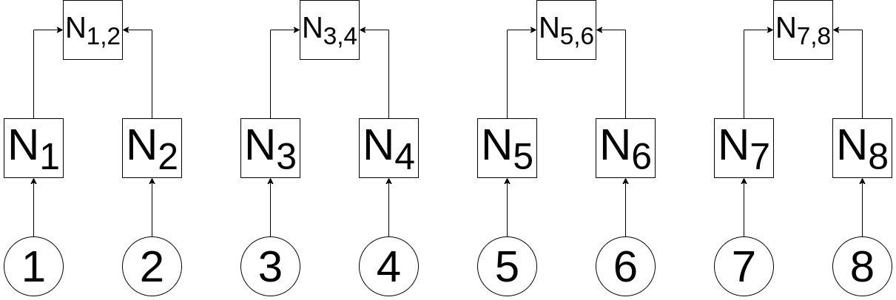

# Merkle_Trees
## What is a Merkle Tree?

In cryptography and computer science, a hash tree or _Merkle Tree_ is a tree in which every "leaf" (node) is labelled with the cryptographic hash of some data. Merkle Trees can be used as a way to prove that data is included in a list while keeping the storage required to perform that proof to a minimum.

Let's see how!

## How does all of this work? Let's build a Merkle Tree

First, we need to start off with a set of data that we want to track. Because they're often used in this manner, let's use a list of Ethereum wallet addresses as our data. In this case, we'll use the following fictituous set of addresses:

```
allowlist = ['0x1111111111111111111111111111111111111111',
              '0x2222222222222222222222222222222222222222',
              '0x3333333333333333333333333333333333333333',
              '0x4444444444444444444444444444444444444444',
              '0x5555555555555555555555555555555555555555',
              '0x6666666666666666666666666666666666666666',
              '0x7777777777777777777777777777777777777777',
              '0x8888888888888888888888888888888888888888']
```

We're going to use this as, say, a list of addresses that are allowed to perform some sort of action on the Ethereum blockchain - perhaps being allowed to purchase an NFT during a pre-sale period.

In the following diagram, we're showing each of our addresses. Item #1 is 0x1111111111111111111111111111111111111111, item #2 is 0x2222222222222222222222222222222222222222, and so on.

&nbsp;


&nbsp;

Wonderful! Now, we're going to apply a cryptographically sound hashing function to each piece of data. In this case N<sub>1</sub> is created by runing our cryptographic function (let's call it H) on data item #1, which we'll designate by N<sub>1</sub> = H(1):

&nbsp;


&nbsp;

In this case, using our designated notation, we have:

N<sub>1</sub> = H(1)

N<sub>2</sub> = H(2)

N<sub>3</sub> = H(3)

N<sub>4</sub> = H(4)

N<sub>5</sub> = H(5)

N<sub>6</sub> = H(6)

N<sub>7</sub> = H(7)

N<sub>8</sub> = H(8)

These nodes (that's why we're calling them _N_) which are the direct result of hashing our data are known as _Leaf Nodes_.

Now, we're going to add the next level up. These nodes (known as _branch_, _inner node_, or _inode_), are created by taking the hash of the two nodes that feed into it, concatenating those values (left to right) and the hashing the resulting value. We'll designate that function as H(L+R):

&nbsp;



&nbsp;

Now, using our designated notation, we've created:

N<sub>1,2</sub> = H(H(1)+H(2))

N<sub>3,4</sub> = H(H(3)+H(4))

N<sub>5,6</sub> = H(H(5)+H(6))

N<sub>7,8</sub> = H(H(7)+H(8))

Adding another level, we have:

&nbsp;


&nbsp;
